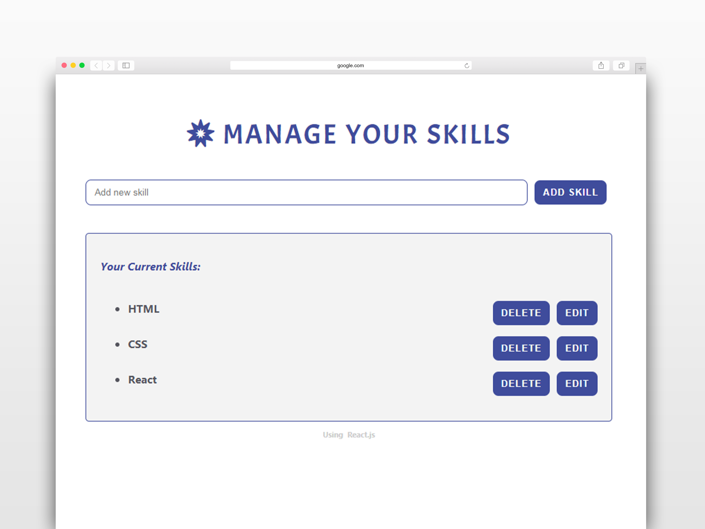

# Reactjs Simple "Skills Management App"

Using the app, you can:
- Add skill
- Edit and update skill
- Delete skill

## The app includes two components:
- Form component
- Skills List component

**Simple CSS with Font Awsome Library is used to style the app**

